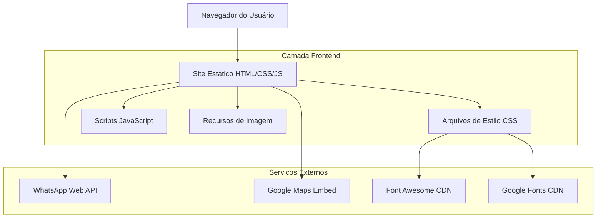

# Documento de Arquitetura Técnica - Melhorias UI/UX Site Argoeste

## 1. Design da Arquitetura



## 2. Descrição da Tecnologia

- Frontend: HTML5 + CSS3 + JavaScript Vanilla
- Estilização: CSS Grid + Flexbox + Custom Properties
- Ícones: Font Awesome 6.4.0
- Fontes: Google Fonts (Montserrat + Roboto)
- Responsividade: Media Queries CSS

## 3. Definições de Rotas

| Rota | Propósito |
|------|-----------|
| / | Página principal com todas as seções |
| #inicio | Seção hero/início |
| #sobre | Seção sobre a empresa |
| #produtos | Seção de produtos |
| #diferenciais | Seção de diferenciais |
| #contato | Seção de contato |
| #localizacao | Seção de localização |
| #instagram | Seção do Instagram |

## 4. Definições de API (Serviços Externos)

### 4.1 WhatsApp Web API

**Endpoint de Contato WhatsApp**
```
GET https://wa.me/5577999742551
```

Parâmetros:
| Nome do Parâmetro | Tipo | Obrigatório | Descrição |
|-------------------|------|-------------|-----------|
| text | string | false | Mensagem pré-programada |

Exemplo de URL:
```
https://wa.me/5577999742551?text=Olá!%20Vim%20pelo%20site%20da%20Argoeste%20e%20gostaria%20de%20mais%20informações%20sobre%20os%20produtos.
```

### 4.2 Google Maps Embed API

**Mapa de Localização**
```
GET https://www.google.com/maps/embed
```

Parâmetros configurados:
- Localização: Rua Peru, 454, Jardins - Barreiras, Bahia
- Zoom e configurações de exibição

## 5. Estrutura de Arquivos

```
/
├── index.html (página principal)
├── styles.css (estilos principais)
├── script.js (funcionalidades JavaScript)
├── instagram-feed.js (feed do Instagram)
└── images/ (recursos visuais)
    ├── logo.png
    ├── hero-image.png
    ├── argamassa-*.png
    └── rejunte*.png
```

## 6. Implementação das Melhorias

### 6.1 Correções CSS para Seção Diferenciais

```css
/* Forçar 4 colunas em desktop */
@media (min-width: 1024px) {
    .features-grid {
        grid-template-columns: repeat(4, 1fr);
        gap: 30px;
    }
}

/* Responsividade para tablet */
@media (max-width: 1023px) and (min-width: 768px) {
    .features-grid {
        grid-template-columns: repeat(2, 1fr);
    }
}
```

### 6.2 Correção JavaScript para WhatsApp

```javascript
// Correção do número de telefone
const phoneNumber = '5577999742551'; // Número correto
```

### 6.3 Melhorias CSS para Produtos

```css
.product-card {
    transition: transform 0.3s ease, box-shadow 0.3s ease;
}

.product-card:hover {
    transform: translateY(-5px);
    box-shadow: 0 15px 30px rgba(0, 0, 0, 0.1);
}
```

### 6.4 Micro-interações e Animações

```css
/* Animações suaves para botões */
.btn {
    transition: all 0.3s cubic-bezier(0.4, 0, 0.2, 1);
}

/* Efeitos hover melhorados */
.feature-card:hover {
    transform: translateY(-8px);
    box-shadow: 0 20px 40px rgba(0, 0, 0, 0.1);
}
```