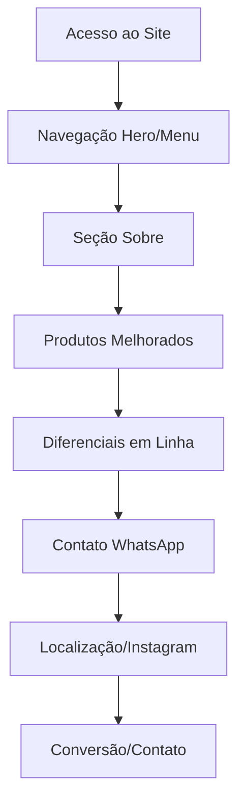

# Documento de Requisitos - Melhorias UI/UX Site Argoeste

## 1. Visão Geral do Projeto

Modernização da interface e experiência do usuário do site da Argoeste, mantendo a identidade visual existente e melhorando a usabilidade, atratividade e conversão. O projeto foca em corrigir problemas específicos identificados e implementar boas práticas de design moderno para tornar o site mais profissional e eficiente.

## 2. Funcionalidades Principais

### 2.1 Papéis de Usuário
Não aplicável - site institucional público sem distinção de usuários.

### 2.2 Módulos de Funcionalidade

Nosso projeto de melhorias consiste nas seguintes páginas principais:
1. **Página Principal**: seção hero, navegação, sobre, produtos, diferenciais, contato, localização, Instagram
2. **Funcionalidades de Contato**: botão WhatsApp, formulário newsletter, informações de contato

### 2.3 Detalhes das Páginas

| Nome da Página | Nome do Módulo | Descrição da Funcionalidade |
|----------------|----------------|------------------------------|
| Página Principal | Seção Nossos Diferenciais | Exibir 4 cards de diferenciais em linha única no desktop, com layout responsivo para mobile. Melhorar espaçamento e hierarquia visual |
| Página Principal | Botão WhatsApp | Corrigir número de telefone de (77) 9 9974-2551, manter mensagem pré-programada e abertura em nova aba |
| Página Principal | Seção Nossos Produtos | Redesenhar cards de produtos com layout mais moderno, melhor hierarquia visual, manter todas as informações técnicas existentes |
| Página Principal | Melhorias Gerais UI/UX | Implementar micro-interações, melhorar tipografia, otimizar espaçamentos, adicionar animações sutis, melhorar contraste |

## 3. Processo Principal

**Fluxo do Usuário Visitante:**
1. Usuário acessa o site
2. Navega pelas seções com interface melhorada
3. Visualiza produtos em layout mais atrativo
4. Consulta diferenciais organizados em linha única
5. Clica no botão WhatsApp com número correto
6. Realiza contato ou solicita orçamento

## 4. Design da Interface do Usuário

### 4.1 Estilo de Design

- **Cores Primárias**: Azul escuro #003366, Azul claro #0066cc, Vermelho #c00808
- **Estilo dos Botões**: Bordas arredondadas (50px), efeitos hover com elevação
- **Tipografia**: Montserrat para títulos (700), Roboto para texto (400-500)
- **Layout**: Grid moderno, cards com sombras suaves, espaçamento consistente
- **Ícones**: Font Awesome, estilo sólido e consistente

### 4.2 Visão Geral do Design das Páginas

| Nome da Página | Nome do Módulo | Elementos da UI |
|----------------|----------------|-----------------|
| Página Principal | Seção Diferenciais | Grid de 4 colunas fixas no desktop, cards com ícones, títulos e descrições, sombras suaves, hover effects |
| Página Principal | Botão WhatsApp | Botão verde WhatsApp com ícone, efeito hover, link correto para wa.me/5577999742551 |
| Página Principal | Seção Produtos | Cards horizontais melhorados, imagens otimizadas, hierarquia visual clara, botões de ação destacados |
| Página Principal | Melhorias Gerais | Animações CSS suaves, transições de 0.3s, micro-interações, espaçamentos otimizados |

### 4.3 Responsividade

Desktop-first com adaptação mobile. Seção diferenciais quebra para 2 colunas em tablet e 1 coluna em mobile. Produtos mantêm layout vertical em todas as telas. Otimização para touch em dispositivos móveis.